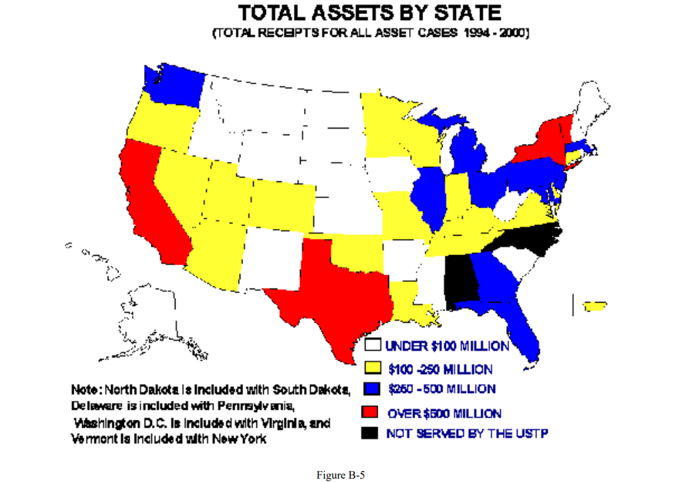

```{r setup, include=FALSE}
library(flexdashboard)
library(tidyverse)
library(lubridate)
library(readxl)
library(openxlsx)
library(forcats)
library(leaflet)
library(rgdal)
library(sf)
library(plotly)
library(tmap)
library(tmaptools)
```

```{r data, include=FALSE}
url <- "https://www.uscourts.gov/file/10864/download"
destfile <- "download.xls"
curl::curl_download(url, destfile)
filings_01 <- read_excel(destfile, range = "a7:f136")

url_f2_18 <- "https://www.uscourts.gov/file/25503/download"
destfile_f2_18 <- "filings_18.xlsx"
filings_18 <- openxlsx::read.xlsx(url_f2_18,
                                  sheet = 1, 
                                  rows = 5:110,
                                  cols = 1:6,
                                  colNames = F)

filings_01 <-  na.omit(filings_01)

#change column names #2001

colnames(filings_01) <- c("state", "all_chap", "ch7", "ch11", "ch12", "ch3")

#remove rows that show circuit totals

filings_01 <- filings_01[c(-1,-3, -9, -16, -23, -33, -43, -53, -61, -72, -88, -97), ]

#modify column 1 by removing the district indicator #convert column1 to factors

filings_01$state <- factor(substr(filings_01$state, start = 1, stop = 2))

filings_01 <- filings_01 %>% 
  group_by(state) %>% 
  summarise(filings_2001 = sum(ch7, na.rm = T))

#remove rows that show circuit totals

filings_18 <- filings_18[c(-1,-3, -9, -16, -23, -33, -43, -53, -61, -71, -87, -96), ]

#change column names #2001

colnames(filings_18) <- c("state", "all_chap", "ch7", "ch11", "ch12", "ch3")

#modify column 1 by removing the district indicator #convert column1 to factors

filings_18$state <- factor(substr(filings_18$state, start =1, stop = 2))

#convert column 3 to numeric #2018

filings_18$ch7 <- as.numeric(filings_18$ch7)

filings_18 <- filings_18 %>% 
  group_by(state) %>% 
  summarise(filings_2018 = sum(ch7, na.rm = T))

ch7_filings <- left_join(filings_01, filings_18)

```

```{r map data, include=FALSE}
#import dataset US_JUDICIAL_DISTRICT_INFO.csv and rename it as jud_dist

jud_dist <- read_csv("~/Job Hunt/Visuals Portfolio/BANKRUPTCY REPORT STUFF/bankruptcy_code/US_JUDICIAL_DISTRICT_INFO.csv")

#read in shapefile that has all of the judicial districts

districts <- readOGR('Court_districts/US_District_Court_Jurisdictions.shp')

#convert to an sf object

districts <- st_as_sf(districts)

#select only the ABBR column and ustp_region column from the jud_dist data frame
ustp_regions <- jud_dist %>% 
  select(ABBR, ustp_region)

#combine the jud_dist dataframe to the districts sf object using ABBR 
district_geo <- left_join(districts, ustp_regions, by = 'ABBR')

#convert the ustp_region variable to a factor
district_geo$ustp_region <- factor(district_geo$ustp_region, levels = c(1, 2, 3, 4, 5, 6, 7, 8, 9, 10, 11, 12, 13, 14, 15, 16, 17, 18, 19, 20, 21, NA))

# simplify the sf object to make it smaller
district_geo <- rmapshaper::ms_simplify(district_geo, keep = 0.05,
                                          keep_shapes = TRUE)
#create a color palette for the regions on the map 
pal <- colorFactor(palette = c("cadetblue", "chartreuse", "chocolate1", 
                               "blue1", "cyan2", "darkgoldenrod1","darkmagenta",
                               "darkorange", "firebrick1", "darkolivegreen3", 
                               "gold", "darkslateblue", "deeppink", "lawngreen", 
                               "lightblue2", "green3", "mediumorchid", "lightgreen",
                               "maroon", 'lightseagreen', 'orange'),
                   levels = c('1', '2', '3', '4', '5', '6', '7', '8', '9', '10',
                              '11', '12', '13', '14', '15', '16', '17', '18', '19', '20', 
                              '21'))

```

Overview
====================================================================

Background {data-width=300}
-----------------------------------------------------------------------

I came across this report while doing research for my Bankruptcy Law Class

The original report was published in 2001 by the Department of Justice

These are some of the charts from the report 

Click the "Charts" tab to view some of the charts that I updated using new Bankruptcy data

In addition to remaking the original charts, I've included some new, interactive charts. 

Chart Examples from Original Report {data-width=700}
-----------------------------------------------------------------------


CH7 Asset Cases by State {.storyboard data-navmenu=Charts}
====================================================================

### Here is a map from the original 2001 report 


### This is a map that I made depicts the same topic, but uses data from 2001-2018


### This is an interactive version of the map, created using leaflet in R

```{r}
#read in the bank office location info 
bank_combo <- read_csv("bank_combo.csv")

#create the map object and save it to m 
m <- leaflet(options = leafletOptions(dragging = TRUE,
                                 minZoom = 4, 
                                 maxZoom = 8)) %>%
  addProviderTiles(providers$Stamen.TonerLite) %>%            
  setView(lng = -95.7129, lat = 37.0902, zoom = 4) %>%  
  addPolygons(data = district_geo,
              fillColor = ~pal(ustp_region),    
              weight = 1,                     
              highlightOptions = highlightOptions(color = "white", weight = 2,
                                                  bringToFront = FALSE),
              label = ~paste0("REGION ", ustp_region),           
              fillOpacity = 0.6)

m %>%  addCircleMarkers(lng = ~lon.y, 
                   lat = ~lat.y,
                   popup = ~paste0(office,
                                   "<br/>",
                                   n, " CASES"),
                   radius = 3,
                   color = 'black', 
                   data = bank_combo)
```


### This chart also focuses on the same topic, but displays the information much better than the original.

```{r}
ch7_bank <- ch7_filings %>% 
  mutate(state = fct_reorder(state, filings_2001)) %>% 
  plot_ly() %>% 
  add_segments(
    x = ~filings_2018, y = ~state, 
    xend = ~filings_2001, yend = ~state, 
    color = I("gray"), showlegend = F
    ) %>% 
  add_markers(
    x = ~filings_2018, y = ~state, 
    color = I('blue'), 
    size = I(12),
    name = 'Filings in 2018') %>% 
  add_markers(
    x = ~filings_2001, y = ~state, 
    color = I('red'),
    size = I(12),
    name = 'Filings in 2001') %>% 
  layout(xaxis = list(title = 'Chapter 7 Filings'),
         yaxis = list(title = 'State'))
ch7_bank
```

***

In addition to providing significantly more information to the viewer, the chart is interactive. 

Try it out

Total Receipts in CH7 Asset Cases {data-navmenu=Charts}
====================================================================


Column {data-width=350}
-----------------------------------------------------------------------

### Dept of Justice Report


Column {data-width=650}
-----------------------------------------------------------------------

### Updated Report


Total Receipts by State {data-navmenu=Charts}
====================================================================


Column {data-width=500}
-----------------------------------------------------------------------

### Dept of Justice Report




Column {data-width=500}
-----------------------------------------------------------------------

### Updated Report


Very Large CH7 Asset Cases {data-navmenu=Charts}
====================================================================


Column {data-width=400}
-----------------------------------------------------------------------

### Dept of Justice Report


Column {data-width=600}
-----------------------------------------------------------------------

### Updated Report


Total Disbursements {data-navmenu=Charts}
====================================================================


Column {data-width=500}
-----------------------------------------------------------------------

### Dept of Justice Report


Column {data-width=500}
-----------------------------------------------------------------------

### Updated Report


Cases with No Payments to Creditors {data-navmenu=Charts}
====================================================================


Column {data-width=350}
-----------------------------------------------------------------------

### Dept of Justice Report


Column {data-width=650}
-----------------------------------------------------------------------

### Updated Report


Distributions by Case Size {data-navmenu=Charts}
====================================================================


Column {data-width=500}
-----------------------------------------------------------------------

### Dept of Justice Report


Column {data-width=500}
-----------------------------------------------------------------------

### Updated Report


Bankruptcy Filings by Chapter {data-navmenu=Charts}
====================================================================


Column {data-width=500}
-----------------------------------------------------------------------

### Dept of Justice Report


Column {data-width=500}
-----------------------------------------------------------------------

### Updated Report


